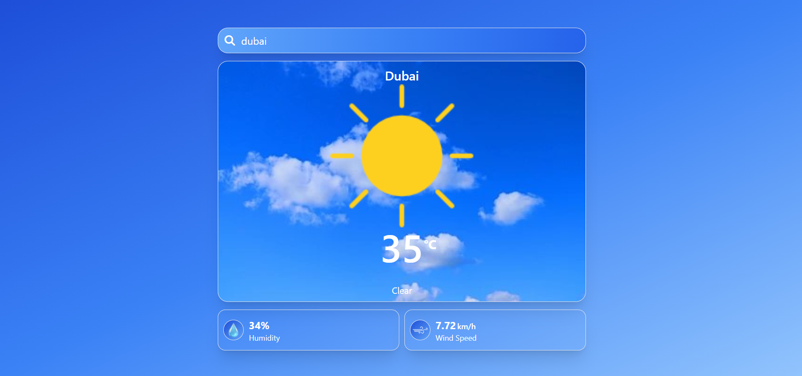
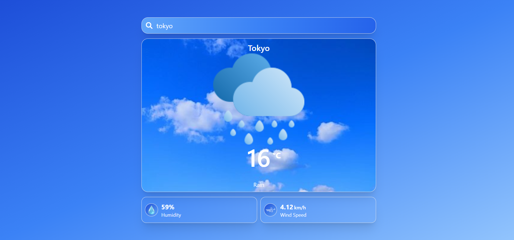
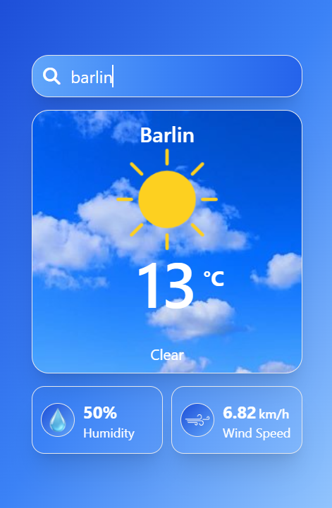
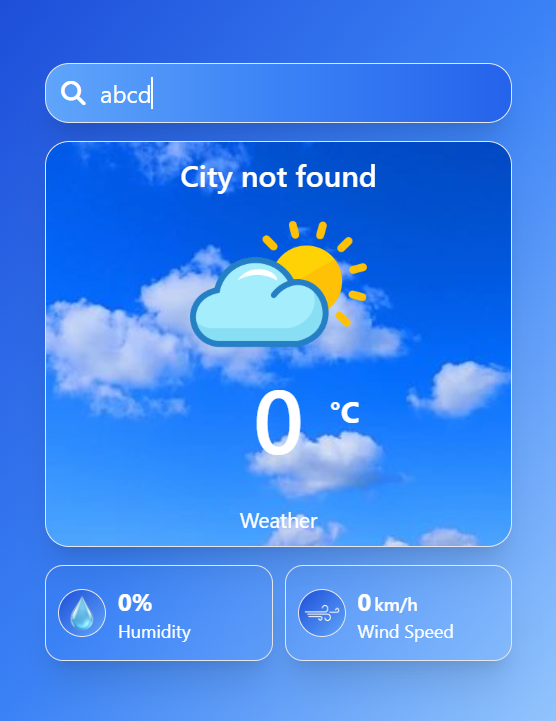

# 🌤️ Weather App

A simple and responsive Weather App that allows users to search for real-time weather information by entering a city name.

## 📸 Preview

### Desktop View

  
  

### Mobile View

  
  

## 🚀 Live Demo

https://weather-tailwind-project.netlify.app

## 📖 About The Project

This Weather App is a simple web-based application designed to provide real-time weather information for any city entered by the user. The main goal of this project was to understand how to integrate external APIs and display dynamic data on a webpage.

## 🚀 Features

- 🔍 Search weather by city name
- 🌡️ Displays temperature, humidity, and weather condition
- 📍 Real-time data using API
- 💻 Responsive UI design
- ⚡ Fast and lightweight
- ❌ Shows error message for incorrect city name

## 🛠️ Technologies Used

- HTML5
- Tailwind CSS
- JavaScript (Vanilla JS)
- Weather API (e.g., OpenWeather API)

## 📚 What I Learned

Through building this project, I gained hands-on experience in:
- 🌐 Working with APIs and fetching live data using JavaScript (fetch)
- 🔄 Handling asynchronous operations (Promises / async-await)
- 🎯 DOM manipulation to dynamically update UI
- 🎨 Designing responsive and clean UI using HTML & Tailwind CSS

## ⚙️ How to Run

1. Clone the repository:

git clone https://github.com/mzeeshankhan-dev/weather-app-using-tailwind-css.git

2. Open the project folder:

cd weather-app

3. Open index.html in your browser

## 👨‍💻 Author

- [Github] (https://github.com/mzeeshankhan-dev)
